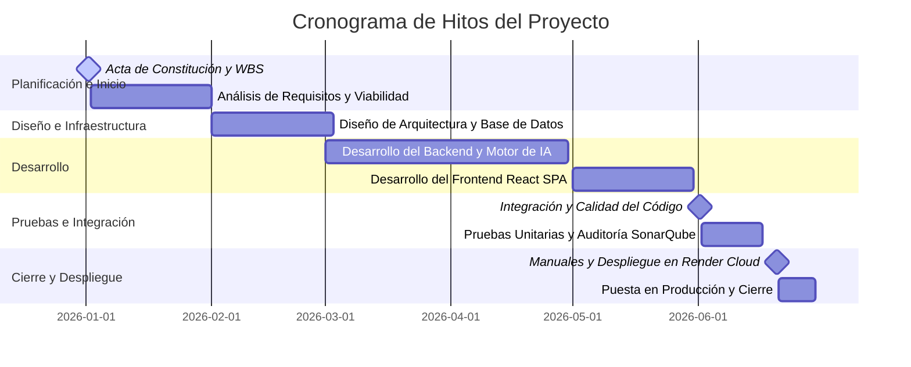

# Acta de Constitución del Proyecto (Project Charter)
## Proyecto: Sistema de Control y Detección de Infracciones de Tránsito mediante Inteligencia Artificial (TrafficViolationSystem)

---

## 1. Información General del Proyecto

| Campo | Detalle |
| :--- | :--- |
| **Nombre del Proyecto** | Sistema Inteligente de Detección de Infracciones de Tránsito (TrafficViolationSystem) |
| **Patrocinador Principal** | Municipalidad Metropolitana / Ministerio de Transportes y Comunicaciones (MTC) |
| **Líder / Gestor de Proyecto** | Director de Tecnología y Seguridad Vial |
| **Fecha de Aprobación** | 2026-06-23 |
| **Versión del Documento** | 1.0.0 |
| **Estado del Documento** | Aprobado |

---

## 2. Propósito y Justificación del Proyecto

El crecimiento descontrolado de la densidad vehicular en las grandes ciudades, sumado a la conducta temeraria de conductores que ignoran las señales de tránsito, representa una de las principales causas de siniestralidad vial y muertes urbanas a nivel global. Las metodologías de fiscalización manual mediante agentes físicos de tránsito no son escalables debido a:
* Limitación de recursos humanos para cubrir el 100% de las intersecciones críticas las 24 horas del día.
* Sesgo humano y tiempos prolongados en la emisión y procesamiento de papeletas de infracción.
* Falta de evidencias visuales irrefutables y transparentes que sustenten la multa, lo que provoca un alto volumen de apelaciones y desconfianza ciudadana.

Para mitigar esta problemática, el **TrafficViolationSystem** propone la automatización del proceso de control vial mediante la implementación de algoritmos avanzados de **Visión Artificial e Inferencia en Tiempo Real**. Al procesar transmisiones y grabaciones de cámaras viales IP mediante redes neuronales convolucionales (YOLOv8) y algoritmos de rastreo clásicos, el sistema detecta de forma autónoma infracciones críticas como el cruce de semáforos en rojo, giros no permitidos en U, y el estacionamiento en zonas peatonales o prohibidas. Esto incrementa la eficiencia de la fiscalización, reduce a cero el sesgo de selección y provee un panel interactivo con boletas de infracción y videos de evidencia precisos.

---

## 3. Descripción General del Proyecto

El sistema está estructurado sobre una arquitectura desacoplada de alto rendimiento compuesta por los siguientes subsistemas principales:
1. **Módulo de Visión Artificial e Inteligencia Artificial (`ia_service`)**:
   * Implementa inferencia dual: **YOLOv8 Nano** (red neuronal entrenada sobre MS COCO) para la detección y delimitación espacial milimétrica de vehículos (automóviles, camiones, motocicletas, autobuses).
   * Algoritmo de **Centroid Tracker** para la asociación temporal de trayectorias a través de la minimización de distancias euclidianas.
   * Motor de reglas geométricas en 2D (línea de parada horizontal, cálculo del vector de inversión de dirección para giros en U y ROI rectangular de inmovilidad para estacionamiento prohibido) para catalogar las multas viales.
   * Procesador OCR integrado para la lectura automática de matrículas vehiculares.
2. **Backend API Rest (FastAPI & SQLAlchemy)**:
   * Diseñado con FastAPI para proporcionar una comunicación asíncrona de alto desempeño.
   * Utiliza `BackgroundTasks` para desacoplar el procesamiento computacional pesado del ciclo de vida de la petición HTTP, devolviendo respuestas instantáneas al frontend y evitando bloqueos de red.
   * Esquema de persistencia robusto con ORM SQLAlchemy, compatible nativamente con **PostgreSQL** para producción y con un mecanismo de resiliencia dinámica que conmuta a un archivo local de base de datos **SQLite** (`fallback.db`) si la base de datos principal experimenta pérdida de conectividad.
3. **Frontend SPA (React & Vite & TailwindCSS/CSS)**:
   * Interfaz de usuario rica e interactiva con diseño de alto impacto visual (modo oscuro con paleta en tonos HSL, gradientes de neón e interacciones fluidas).
   * Reproductor HTML5 sincronizado en dos direcciones con los datos del reporte de infracciones mediante el evento `timeupdate`, permitiendo saltar interactivamente al segundo exacto de la infracción y renderizando recuadros delimitadores dinámicos sobre el video de forma interactiva.
   * Panel analítico administrativo (dashboard) con tendencias de infracciones, métricas clave recopiladas en base de datos SQL y un módulo dinámico de la **Matriz de Operacionalización de Variables**.

---

## 4. Objetivos del Proyecto y Criterios de Éxito

| ID | Objetivo del Proyecto | Métrica / Criterio de Éxito |
| :--- | :--- | :--- |
| **OBJ-01** | Automatizar la detección de infracciones viales en videos de cámaras urbanas. | Tasa de acierto de detección de vehículos y tipología de infracción $\ge 90\%$ en videos de prueba con luz diurna y resolución estándar. |
| **OBJ-02** | Optimizar el tiempo de respuesta del operador en la validación de evidencias. | Implementación del reproductor web sincronizado con salto dinámico al segundo exacto del incidente, reduciendo el tiempo de auditoría a menos de 5 segundos por video. |
| **OBJ-03** | Garantizar la disponibilidad y resiliencia del almacenamiento relacional de infracciones. | Conmutación automática y en caliente al archivo de base de datos SQLite local (`fallback.db`) en caso de caída del servidor central PostgreSQL, con pérdida de datos igual a 0%. |
| **OBJ-04** | Medir en tiempo real el desempeño técnico y operativo del sistema. | Visualización dinámica de la Matriz de Operacionalización en el frontend mediante consultas SQL optimizadas agregadas en menos de 200ms en el endpoint `/api/v1/analytics/operationalization`. |

---

## 5. Requisitos de Alto Nivel del Sistema

* **Funcionales**:
  * Carga y almacenamiento físico de videos viales con límite y validación de extensiones y flujos secuenciales de escritura en disco a bloques de `1MB` para control de consumo de RAM.
  * Inferencia automática de 3 tipos de infracciones: Semáforo en rojo, Giro prohibido en U, Parqueo en zona de exclusión peatonal.
  * Reconocimiento óptico de caracteres (OCR) sobre placas vehiculares y resolución de propietarios cruzando datos relacionales con la base de datos de ciudadanos.
  * Autenticación segura mediante contraseñas cifradas con SHA-256 + semilla del sistema y control de sesiones mediante tokens portadores persistidos en `localStorage`.
  * Panel administrativo de estadísticas viales interactivas y visualización de la Matriz de Operacionalización.
* **No Funcionales**:
  * Interfaz adaptativa e interactiva en modo oscuro con elementos de diseño premium y micro-animaciones en CSS.
  * Portabilidad absoluta y cero dependencias de compilación complejas (uso de librerías nativas como `hashlib` y fallback SQLite integrado).
  * Compatibilidad del código SQL y agregación en base de datos independiente del dialecto (SQLite / PostgreSQL).
  * Despliegue listo para la nube e infraestructura de contenedores (Docker y soporte para Render Cloud).

---

## 6. Cronograma e Hitos Principales

El proyecto se estructuró a lo largo de un período de 6 meses divididos en las siguientes etapas clave:



---

## 7. Presupuesto Estimado e Inversión Inicial

La asignación financiera preliminar para el desarrollo y despliegue del sistema se detalla en el siguiente cuadro:

| Categoría | Concepto | Costo Estimado (USD) |
| :--- | :--- | :--- |
| **Infraestructura Cloud** | Servidores de Inferencia GPU + PostgreSQL administrado | $3,500.00 |
| **Licencias y Modelos** | Entrenamiento de pesos customizados y software | $1,200.00 |
| **Recursos Humanos** | Arquitecto de Software, Ingeniero de IA y Desarrolladores | $25,000.00 |
| **Consultoría Legal** | Validación de normativa vial y firma digital de boletas | $1,800.00 |
| **Contingencias** | Reservas operativas (10%) | $3,150.00 |
| **Total Inversión** | **Inversión Total Estimada** | **$34,650.00** |

---

## 8. Stakeholders (Partes Interesadas) y Matriz de Roles

* **Patrocinador (Municipalidad)**: Provee los fondos, revisa las métricas de éxito y audita los indicadores de la Matriz de Operacionalización.
* **Líder de Proyecto / Product Owner**: Define los requisitos funcionales, coordina la entrega y supervisa el plan de gestión del cronograma.
* **Ingeniero de Visión Artificial (IA)**: Responsable de optimizar `ia_service.py`, calibrar hiperparámetros de YOLOv8, ajustar la lógica de seguimiento Centroid Tracker y garantizar que la tasa de precisión del modelo sea óptima.
* **Desarrollador Full Stack**: Encargado del backend FastAPI, la conmutación resiliente SQL, la API rest y la interfaz de usuario interactiva con el reproductor sincronizado en React.
* **Oficiales y Operadores de Tránsito**: Usuarios finales que interactúan con la interfaz para auditar videos cargados y validar las infracciones emitidas por el sistema.

---

## 9. Riesgos Principales y Planes de Mitigación

1. **Riesgo: Caída de la base de datos central de producción (PostgreSQL).**
   * *Gravedad*: Alta.
   * *Mitigación*: Implementación del patrón de fallback automatizado en `db.py` que detecta la interrupción del servicio PostgreSQL y redirige el flujo transaccional a un archivo SQLite persistente (`fallback.db`) en caliente, preservando los datos recopilados por el motor de IA.
2. **Riesgo: Falsos positivos en la detección de vehículos o falsos cruces en semáforos.**
   * *Gravedad*: Media-Alta.
   * *Mitigación*: Calibración y exposición de hiperparámetros editables en el backend (e.g., `STOP_LINE_COEFF`, `STATIONARY_PIXELS_THRESHOLD`). Adicionalmente, el sistema implementa una interfaz de validación humana donde el operador puede saltar al cuadro exacto para desestimar boletas erróneas antes de emitir la multa formal.
3. **Riesgo: Alto consumo de memoria RAM por la carga masiva y concurrente de videos en la API.**
   * *Gravedad*: Media.
   * *Mitigación*: Implementación del lector secuencial de archivos en FastAPI que escribe en disco en bloques compactos de `1MB` en lugar de alojar la totalidad del archivo de video en la memoria RAM del servidor.

---

## 10. Firmas y Aprobaciones del Acta

Al firmar este documento, los stakeholders formalizan el alcance, los objetivos y la planificación descrita, autorizando la asignación de recursos y el inicio de las fases de ejecución del software.

```
__________________________________
Patrocinador Principal
Director de Seguridad Vial del Estado

__________________________________
Líder del Proyecto / Product Owner
TrafficViolationSystem Engineering
```
