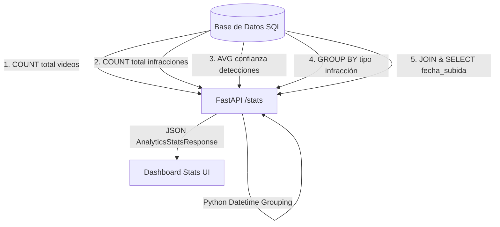

# Análisis de Seguridad y Metodología de Analíticas

Este documento detalla el modelo de seguridad informática, el esquema de autenticación y la metodología de agregación de datos estadísticos para el panel de analíticas viales (dashboard) implementados en el sistema de control de infracciones de tránsito.

---

## 1. Modelo de Seguridad y Autenticación

El sistema implementa un esquema de seguridad perimetral para restringir las operaciones críticas del backend (subida de videos, consulta de infracciones, visualización de estadísticas) únicamente a personal de tránsito autorizado.

### A. Almacenamiento Seguro de Credenciales (Haseo y Salado)
Para evitar riesgos derivados de ataques de fuerza bruta o filtración de bases de datos, las contraseñas no se almacenan en texto plano. 

* **Algoritmo**: SHA-256 (Secure Hash Algorithm 256 bits).
* **Salado (Salting)**: Se utiliza una llave de sal estática del sistema (`TrafficViolationSaltSystemKey`) concatenada al texto plano de la contraseña antes de aplicar la función hash. Esto previene el uso de tablas arcoíris (*rainbow tables*).
* **Ausencia de dependencias críticas**: La derivación de claves se realiza a través de la biblioteca nativa `hashlib` de Python para garantizar portabilidad multiplataforma inmediata sin requerir la compilación en C/C++ de dependencias externas (como `bcrypt` o `cryptography`).

$$Hash = SHA256(Contraseña + Sal)$$

```python
# Implementación conceptual en backend/app/routes/auth_routes.py
def get_password_hash(password: str) -> str:
    salted_pwd = password + "TrafficViolationSaltSystemKey"
    return hashlib.sha256(salted_pwd.encode('utf-8')).hexdigest()
```

### B. Inicialización y Datos Semilla
El sistema cuenta con un mecanismo de siembra automática (*seeding*) en el evento de inicio del servidor (`startup`), el cual verifica la existencia de cuentas y crea el usuario por defecto:
* **Usuario**: `admin`
* **Contraseña**: `admin123`

---

## 2. Estrategia de Sesión (Mock JWT)

El control de sesión sigue un protocolo similar a JSON Web Tokens (JWT) mediante tokens portadores (*Bearer tokens*) guardados temporalmente en el cliente.

### A. Estructura del Token
Al autenticarse con éxito a través del endpoint `/api/v1/auth/login`, el backend genera y devuelve una firma de sesión única con el siguiente formato:
```python
session_token = f"session_token_{user.id}_{uuid.uuid4().hex[:8]}"
```
Este token asocia el identificador único del usuario (`user.id`) con un sufijo pseudoaleatorio criptográficamente seguro de un solo uso.

### B. Flujo de Control en Frontend (LocalStorage y Guardias)
1. **Persistencia**: Tras recibir una respuesta exitosa, el frontend almacena el `access_token` y el `username` en el `localStorage` del navegador.
2. **Autorización**: Todas las peticiones posteriores del frontend pueden anexar el token en la cabecera `Authorization: Bearer <token>`.
3. **Guardia de Rutas**: En `App.jsx`, el enrutador condicional evalúa el estado del token. Si el token está ausente, el renderizado de la UI fuerza la visualización exclusiva del componente de inicio de sesión (`Login.jsx`), protegiendo herméticamente las rutas `/upload`, `/report` y `/analytics`.
4. **Cierre de Sesión**: La acción de Logout purga el `localStorage` y devuelve instantáneamente al usuario a la pantalla de inicio de sesión.

---

## 3. Consultas Analíticas y Agregaciones SQL

El dashboard de estadísticas del sistema compila un reporte consolidado de la actividad vial mediante consultas de agregación optimizadas sobre SQLAlchemy.



### A. Consultas de Agregación Realizadas
El endpoint `/api/v1/analytics/stats` ejecuta las siguientes operaciones analíticas:
1. **Total de Videos**: Conteo cuantitativo de registros en la tabla `videos`.
2. **Total de Infracciones**: Conteo cuantitativo de registros en la tabla `infracciones`.
3. **Promedio de Certeza de IA**: Agregación promedio (`func.avg`) sobre la columna `confianza` de la tabla `infracciones`.
4. **Distribución por Tipología**: Agrupación (`GROUP BY`) por el campo `tipo` y conteo de incidencias para desglosar la frecuencia de cada comportamiento indebido (p. ej. Cruce de semáforo en rojo, Giro prohibido, Invasión de paso peatonal).

### B. Agrupamiento de Tendencias Temporal (Compatibilidad Agnóstica)
Para graficar el historial cronológico de multas detectadas día a día, se requiere agrupar las infracciones por fecha. 
* **El Desafío**: PostgreSQL y SQLite manejan las funciones de formateo de fecha de manera completamente diferente (`TO_CHAR` vs `strftime` en base de datos).
* **La Solución**: Se realiza un `JOIN` entre las tablas `infracciones` y `videos` para obtener la fecha de subida del video (`Video.fecha_subida`). La agrupación temporal y el conteo se realizan en la capa de aplicación (FastAPI) usando la clase nativa de Python `collections.Counter` y formateando con `.strftime("%Y-%m-%d")`.
* **Beneficio**: Esto garantiza compatibilidad de código unificada y previene errores SQL sin importar el dialecto de la base de datos subyacente.

---

## 4. Resiliencia y Fallback de Base de Datos

El sistema implementa una arquitectura híbrida de conexión a base de datos en `db.py` para asegurar que el sistema nunca deje de funcionar por problemas de infraestructura.

### A. Flujo de Conexión y Respaldo
1. **Conexión Principal (PostgreSQL)**: El backend intenta conectarse a la URL especificada en `DATABASE_URL` (comportamiento estándar en entornos de producción/Docker).
2. **Captura del Fallo**: Si la base de datos PostgreSQL no responde o no está instalada, el bloque `try-except` captura el error.
3. **Activación de SQLite Local**: Se crea un archivo de base de datos SQLite físico denominado `fallback.db` dentro del directorio `backend/app/` y se reconfigura el motor de SQLAlchemy en caliente.
4. **Persistencia Consistente**: A diferencia de una base de datos en memoria (`:memory:`), la base de datos `fallback.db` es un archivo físico en disco. Esto garantiza que las tablas de usuarios y los registros de videos e infracciones persistan entre reinicios de la API y sean visibles simultáneamente en múltiples hilos y peticiones HTTP concurrentes.
