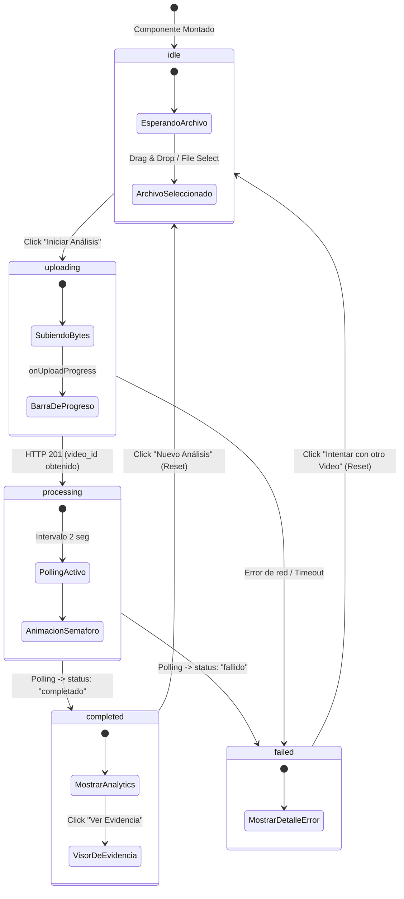

# Flujo del Frontend en React y Máquina de Estados (UploadVideo)

Este documento detalla la especificación del flujo de desarrollo, la máquina de estados de la interfaz de usuario y las integraciones del cliente React localizadas en `frontend/src/pages/UploadVideo.jsx` y `frontend/src/pages/UploadVideo.css` para comunicarse de manera robusta con las APIs del backend.

---

## 1. Máquina de Estados de la Interfaz de Usuario

Para ofrecer una experiencia de usuario fluida y sin recargas de página (Single Page Application), el componente principal implementa una **máquina de estados finitos** mediante el hook `useState` que controla qué paneles y componentes visuales se renderizan en cada instante:



---

## 2. Características e Integraciones Técnicas Clave

### A. Zona de Arrastre Interactiva (Drag & Drop Dropzone)
* El cliente React intercepta los eventos nativos de arrastre del navegador (`onDragEnter`, `onDragOver`, `onDragLeave`, `onDrop`) sobre la zona visual de carga.
* Valida del lado del cliente la extensión del archivo, restringiéndolo únicamente a formatos válidos de video (`.mp4`, `.avi`, `.mov`, `.mkv`).
* Ofrece retroalimentación estética premium (bordes de color Indigo resplandeciente y efecto de sombreado glow de fondo) cuando el archivo se sitúa encima del área de carga.

### B. Monitor de Carga con Progreso de Bytes (Axios)
Para archivos de video pesados es indispensable mostrar una barra de progreso real. La subida se realiza mediante una petición HTTP `POST` multipart/form-data con **Axios**, capturando el progreso mediante la cabecera `onUploadProgress` proveída por la API del navegador:

```javascript
const formData = new FormData()
formData.append('file', file)

const response = await axios.post(`${BACKEND_URL}/api/v1/videos/upload-video`, formData, {
  headers: {
    'Content-Type': 'multipart/form-data'
  },
  onUploadProgress: (progressEvent) => {
    // Calcular porcentaje de carga real
    const percentCompleted = Math.round((progressEvent.loaded * 100) / progressEvent.total)
    setUploadProgress(percentCompleted)
  }
})
```

La barra de carga física en el CSS se actualiza instantáneamente aplicando la propiedad reactiva `style={{ width: `${uploadProgress}%` }}` sobre el contenedor de llenado, animando los bordes con transiciones fluidas.

### C. Motor de Consulta Periódica Resiliente (Polling Engine)
Tras obtener un HTTP 201 exitoso, la API del backend devuelve el `video_id` e inicia la IA en segundo plano. El frontend entra en estado `processing` y activa un ciclo de **polling asíncrono cada 2 segundos**:

* Realiza consultas `GET /api/v1/videos/infracciones/{video_id}`.
* **Cierre seguro**: El intervalo se limpia automáticamente con `clearInterval` en cuanto el estado devuelto en la respuesta cambia a `"completado"` o `"fallido"`.
* **Protección contra fugas de memoria (Memory Leaks)**: Si el usuario abandona la página o cierra el componente antes de concluir el análisis de la IA, el hook de limpieza de React retorna la función de des-suscripción para destruir el intervalo, evitando consumos inútiles de red en segundo plano.

### D. Visor Modal de Evidencia Fotográfica (OpenCV frames)
Al completarse el análisis, se habilita una grilla responsiva con tarjetas de incidentes detectados. Al hacer clic en "Ver Evidencia", se despliega un overlay modal con efecto de desenfoque de fondo glassmorphic, que carga físicamente la imagen generada por el backend en el servidor estático:

```text
URL de Evidencia: http://localhost:8000/uploads/frames/{infraccion_id}.jpg
```

Esta imagen es el fotograma exacto recortado por OpenCV que contiene el recuadro rojo y la etiqueta de la IA superpuesta, permitiendo a los operadores del sistema verificar visualmente la veracidad del reporte.

---

## 3. Guía de Arranque y Ejecución del Frontend

### Paso 1: Instalar Dependencias
Navegue a la carpeta del frontend e instale todos los paquetes declarados en el package.json:

```bash
cd frontend
npm install
```

### Paso 2: Servidor de Desarrollo (Vite)
Para levantar el servidor de desarrollo ultrarrápido con Vite, ejecute:

```bash
npm run dev
```

El frontend estará disponible en: [http://localhost:5173](http://localhost:5173) o la dirección asignada por la consola.

### Paso 3: Integración del Sistema Completo
1. Asegúrese de tener el backend FastAPI corriendo (`uvicorn app.main:app --reload` en el puerto `8000`).
2. Abra el frontend en su navegador.
3. Cargue el video generado por el script sintético (`video_test_infracciones.mp4`).
4. **Disfrute del espectáculo**: verá la barra de progreso subir a 100%, el semáforo animado cargando el procesamiento de IA cuadro a cuadro, y al cabo de unos segundos el dashboard de control vial cargará las 4 infracciones con sus placas, confianzas y el visor modal de fotogramas físicos perfectamente sincronizados en su pantalla.
