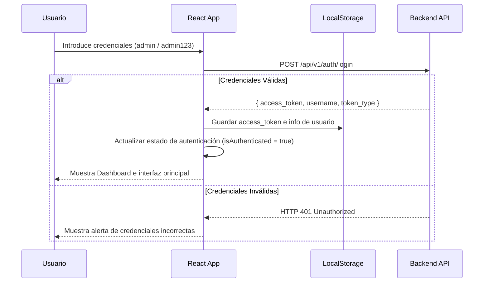

# Guía de Módulos: Inicio de Sesión, Dashboard de Analíticas y Gráficos SVG Neón

Este documento describe detalladamente la arquitectura técnica, diseño y flujos de implementación del frontend en React para los nuevos módulos integrados: **Inicio de Sesión** y el **Panel de Estadísticas y Analíticas**.

---

## 1. Módulo de Inicio de Sesión (Login) y Guardias de Sesión

Para garantizar un acceso seguro, el frontend implementa un control de sesión persistente con bloqueo de rutas en el lado del cliente.

### A. Flujo de Autenticación
1. **Interfaz Premium Glassmorphic** (`Login.jsx` / `Login.css`): Diseñada sobre un panel traslúcido con efectos de desenfoque de fondo (`backdrop-filter: blur`), bordes con degradados sutiles y animaciones interactivas al enviar el formulario.
2. **Consumo de la API**: Al enviar el formulario, se realiza una solicitud `POST` a `/api/v1/auth/login` con el usuario y contraseña.
3. **Persistencia de Sesión**: Si las credenciales son válidas, el cliente guarda el `access_token` y el `username` en el almacenamiento local del navegador (`localStorage`).



### B. Guardia de Rutas en `App.jsx`
La seguridad en la navegación no depende de un enrutador complejo, sino de un renderizado condicional controlado por estado reactivo:
* Al arrancar, el componente principal evalúa si existe un `auth_token` válido en el `localStorage`.
* Si no hay token de sesión, la aplicación omite la barra de navegación principal y renderiza **exclusivamente** el componente `<Login />`.
* Al realizar la acción de cerrar sesión (Logout), se purga el `localStorage`, se restablece el estado local de React y la aplicación regresa inmediatamente a la pantalla de inicio de sesión de forma segura.

---

## 2. Panel de Estadísticas (DashboardStats.jsx)

El dashboard administrativo (`DashboardStats.jsx` / `DashboardStats.css`) permite observar a simple vista el estado del flujo vial recopilando datos agregados en tiempo real.

### A. Estructura y Secciones de la UI
* **Tarjetas de Métricas**: Paneles interactivos que muestran los KPI principales (Total de Videos Analizados, Total de Infracciones Detectadas, Certeza Promedio del Motor de IA).
* **Gráfico de Distribución (Barras SVG)**: Visualización en barras del volumen de multas clasificadas según la tipología vial.
* **Gráfico de Tendencia (Línea SVG)**: Gráfico lineal que ilustra cronológicamente la fluctuación diaria de infracciones registradas en la plataforma.
* **Mini-Log de Eventos Recientes**: Tabla responsiva con scroll que lista los últimos 5 incidentes viales detectados por el sistema, indicando el tipo, marca de tiempo y matrícula con un enlace directo a la visualización de la evidencia fotográfica.

---

## 3. Visualizaciones SVG Nativas con Estilos Neón (Sin Dependencias)

Para cumplir con las restricciones de entorno y asegurar un rendimiento óptimo de renderizado sin dependencias externas propensas a errores (como Chart.js o Recharts), todos los gráficos se construyeron de forma nativa mediante elementos de gráficos vectoriales (**SVG**) acoplados con estilos CSS neón y glassmorphic.

```text
Estructura de un Gráfico Lineal SVG Dinámico:
┌────────────────────────────────────────────────────────┐
│  SVG (viewBox="0 0 500 200")                           │
│  ┌──────────────────────────────────────────────────┐  │
│  │ Eje Y Grid (Líneas horizontales discontinuas)    │  │
│  │ ──────────────────────────────────────────────── │  │
│  │ Polínea de Datos (stroke="url(#trendGradient)")  │  │
│  │          /\   /\                                 │  │
│  │         /  \_/  \                                │  │
│  │        /         \                               │  │
│  │ ──────/───────────\─────── Eje X                 │  │
│  └──────────────────────────────────────────────────┘  │
└────────────────────────────────────────────────────────┘
```

### A. Matemática y Coordenadas Dinámicas
Para graficar vectores variables dentro de un lienzo rígido de SVG con dimensiones predefinidas (por ejemplo, `viewBox="0 0 500 200"`), se implementaron mapeadores matemáticos en React:

* **Mapeo del Gráfico de Barras**:
  * Ancho del lienzo: $W = 500$, Alto del lienzo: $H = 200$
  * Se asigna un ancho proporcional a cada barra en función del número de tipologías.
  * La altura de cada barra se escala dinámicamente según el valor máximo del conjunto de datos:
    $$\text{Altura Barra}_i = \left( \frac{\text{Conteo}_i}{\text{Valor Máximo}} \right) \times (H - 40)$$
  * Esto asegura que las barras aprovechen al máximo el lienzo vertical sin desbordarse.

* **Mapeo del Gráfico de Línea de Tendencias**:
  * Para $N$ puntos cronológicos, se divide el eje X de forma uniforme:
    $$X_i = \left( \frac{i}{N - 1} \right) \times (W - 80) + 40$$
  * La coordenada Y de cada nodo se calcula de forma invertida (dado que la coordenada Y del SVG inicia en $0$ en la esquina superior):
    $$Y_i = H - 30 - \left( \frac{\text{Valor}_i}{\text{Valor Máximo}} \right) \times (H - 60)$$
  * Los puntos $(X_i, Y_i)$ calculados se unen en una cadena de texto para conformar el atributo `points` de un elemento `<polyline />`.

### B. Estilo Neón y Degradados en CSS
Los efectos de brillo premium neón se logran mediante filtros SVG nativos y degradados lineales acoplados a animaciones CSS:
* **Filtros de Desenfoque**: Definición de `<filter id="neonGlow">` con `<feGaussianBlur stdDeviation="3.5" result="coloredBlur"/>` para proyectar un halo de luz difusa bajo las líneas y barras.
* **Gradientes de Color**: Uso de `<linearGradient>` en las definiciones del SVG para rellenar las barras con transiciones suaves (de Azul Cyan a Indigo Eléctrico).
* **CSS Glow**: Clases CSS con efectos `filter: drop-shadow(0 0 8px rgba(0, 242, 254, 0.6))` para dar dinamismo interactivo en eventos `:hover` sobre las barras de estadísticas.

```css
/* Ejemplo conceptual de sombreado y brillo neón */
.bar-rect {
  transition: all 0.3s ease;
  filter: drop-shadow(0 0 2px var(--accent-cyan));
}
.bar-rect:hover {
  fill: var(--accent-pink) !important;
  filter: drop-shadow(0 0 10px var(--accent-pink));
  cursor: pointer;
}
```

---

## 4. Sincronización y Actualización de Datos (Polling a Stats)

El dashboard cuenta con un mecanismo de actualización periódica para mantener la información al día:
1. Al montarse la vista, se dispara una petición `GET` a `/api/v1/analytics/stats`.
2. Se establece un timer mediante `setInterval` para volver a consultar las estadísticas del sistema cada 10 segundos de forma pasiva.
3. El frontend actualiza los componentes reactivos únicamente si se detectan variaciones en los datos analíticos, minimizando el impacto de re-renderizado en el navegador.
4. Cuando el usuario carga y procesa un video en la pestaña **Subir Video**, el cambio de estado del sistema se propaga inmediatamente. Al navegar a la pestaña **Estadísticas**, el dashboard refleja instantáneamente el nuevo video analizado, el incremento en la cantidad de infracciones y el reajuste del gráfico cronológico de tendencias.
