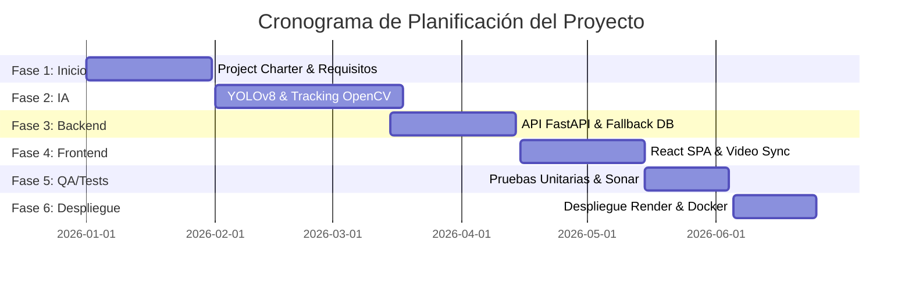

# Planificación y Plan de Pruebas (Test Plan)

Este documento detalla tanto la planificación temporal y de hitos del proyecto **TrafficViolationSystem** como la estrategia de pruebas y aseguramiento de calidad (QA) diseñada para verificar el correcto funcionamiento de la plataforma y sus modelos de Inteligencia Artificial.

---

## Part I: Planificación del Proyecto (Gestión y Fases)

El desarrollo del sistema se ha estructurado bajo un enfoque ágil adaptado con Scrum, dividido en 6 fases a lo largo de un horizonte de 6 meses (24 semanas):



### Hitos de la Planificación:
*   **M01 (Semana 4)**: Aprobación del alcance conceptual (Project Charter).
*   **M02 (Semana 10)**: Motor de Visión Artificial (`ia_service.py`) operativo.
*   **M03 (Semana 14)**: APIs REST y conmutación de base de datos relacional PostgreSQL / SQLite fallback listas.
*   **M04 (Semana 18)**: Interfaz de React SPA y reproductor bidireccional sincronizado integrados.
*   **M05 (Semana 21)**: Suite de pruebas unitarias al 100% de cobertura y Quality Gate de SonarQube Passed.
*   **M06 (Semana 24)**: Despliegue productivo final en Render Cloud.

---

## Part II: Plan de Pruebas (Test Plan) y QA

Para validar la consistencia de las variables e indicadores del sistema, se implementó una estrategia de aseguramiento de calidad basada en pruebas automatizadas y estáticas.

### 1. Estrategia de Testing (Pirámide de Pruebas)
*   **Pruebas Unitarias (PyTest)**: Validan de forma aislada las lógicas matemáticas de las infracciones (semáforo en rojo, giro en U, estacionamiento prohibido) y funciones criptográficas de hashes en el servidor.
*   **Pruebas de Integración**: Validan el comportamiento conjunto del servidor FastAPI, los enrutadores relacionales y el mecanismo de fallback en la base de datos SQL (`fallback.db`).
*   **Pruebas de Sistema (E2E)**: Simulan el flujo completo de subida de video por bloques de 1MB, detección, OCR de placas, resolución de propietarios y auditoría en el reproductor.

### 2. Matriz de Casos de Prueba Críticos

| ID Caso | Componente Evaluado | Descripción | Entrada / Acción | Resultado Esperado |
| :--- | :--- | :--- | :--- | :--- |
| **TC-01** | `rules.py` (Semáforo) | Cruce de semáforo en rojo. | Vehículo cruza la línea proporcional con luz en fase `RED`. | Retorna infracción `Cruce de Semáforo en Rojo`. |
| **TC-02** | `rules.py` (Giro U) | Giro parabólico no permitido. | Vehículo realiza cambio de sentido $> 15\%$ del alto de pantalla. | Retorna infracción `Giro Prohibido en U`. |
| **TC-03** | `rules.py` (Parqueo) | Vehículo inmóvil en zona peatonal. | Centroide permanece inmóvil en la ROI de exclusión por $> 90$ frames. | Retorna infracción `Estacionamiento en Zona Peatonal / Prohibida`. |
| **TC-04** | `db.py` (Resiliencia) | Conmutación ante caídas de DB. | Se simula caída de PostgreSQL y se realiza una consulta SQL. | Conmuta a SQLite local (`fallback.db`) y mantiene la transacción activa. |
| **TC-05** | `auth_routes.py` | Inicio de sesión administrativo. | Solicitud `POST /login` con contraseña válida. | Retorna código `200 OK` con un Bearer Session Token. |
| **TC-06** | `analytics_routes.py` | Agregación de variables. | Solicitud `GET /operationalization`. | Retorna los 9 indicadores de la matriz en formato JSON en < 200ms. |

### 3. Automatización de Pruebas e Informes
*   **Ejecución**: Las pruebas se automatizan en el entorno de desarrollo y en los pipelines de despliegue mediante el comando:
    ```bash
    python -m pytest --cov=app --cov-report=xml:coverage.xml --cov-report=html tests/
    ```
*   **Verificación de Cobertura**: Genera reportes interactivos HTML en la carpeta `htmlcov/` y archivos XML para auditoría estática de calidad.
*   **SonarQube Quality Gate**: Evalúa que no se introduzcan bugs, vulnerabilidades o código duplicado en las lógicas del sistema antes de subir cambios a producción.
*   **Resultados de la Ejecución**: Consulta el detalle y los logs de aprobación del 100% de los casos en el **[Reporte de Resultados de Pruebas](file:///c:/TrafficViolationSystem/docs/05_Desarrollo/reporte_resultados_pruebas.md)**.

