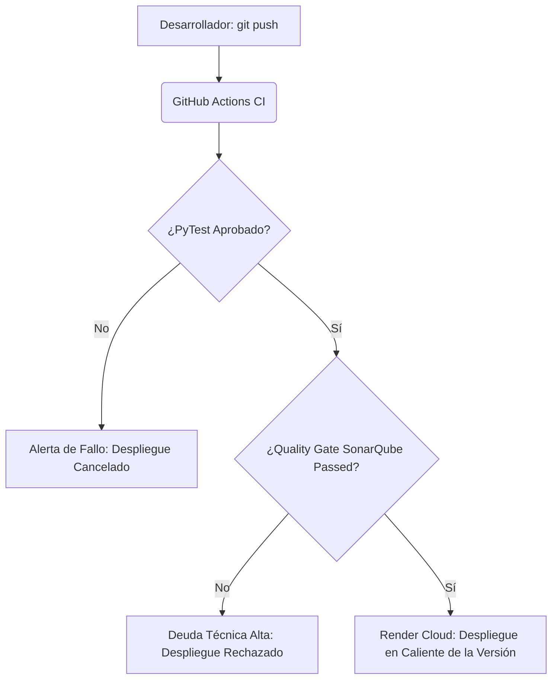

# Plan de Mantenimiento e Implementación de Pruebas Automatizadas

Este documento define las directrices del plan de mantenimiento (correctivo, preventivo y evolutivo) y especifica la arquitectura para la ejecución y automatización de pruebas integradas del **TrafficViolationSystem** durante su fase operativa.

---

## 1. Plan de Mantenimiento Operativo

Para asegurar que la plataforma web y el servicio de Inteligencia Artificial operen sin degradación de rendimiento, se estructuran tres tipos de actividades de mantenimiento periódico:

### A. Mantenimiento Preventivo (Optimización e Infraestructura)
*   **Limpieza y Rotación de Videos**: Los videos MP4 cargados en `backend/app/uploads/` pueden saturar el disco. Se establece un script de rotación cron semanal que archiva videos procesados con antigüedad superior a 30 días en almacenamiento en frío (Amazon S3 / Azure Blob) o los purga si las boletas ya han sido auditadas y firmadas legalmente.
*   **Compactación e Índices de Base de Datos**: Mantenimiento mensual de PostgreSQL mediante la ejecución de tareas de reindexado y vacuuming sobre las tablas `infractions` y `audit_logs` para asegurar que las consultas del dashboard analítico sigan respondiendo en menos de 200ms.
*   **Monitoreo de Red Vial**: Validación periódica del estado de latido de las cámaras IP registradas en la base de datos relacional.

### B. Mantenimiento Correctivo (Resolución de Incidencias)
*   **Fallback Transaccional**: Si la base de datos PostgreSQL principal falla, la API conmuta en caliente a `fallback.db` (SQLite local). El protocolo correctivo exige:
    1.  Restaurar el servicio del servidor PostgreSQL central.
    2.  Ejecutar el script de sincronización relacional que vuelca los registros acumulados en SQLite a la base de datos PostgreSQL de producción.
    3.  Reiniciar la conexión de FastAPI.
*   **Excepciones de Captura OpenCV**: Manejo de fotogramas corruptos o códecs de video no soportados mediante bloques `try-except` robustos en `ia_service.py` que marcan el video como `fallido` con su mensaje de error detallado en lugar de congelar el hilo de ejecución principal.

### C. Mantenimiento Evolutivo (Entrenamiento de IA)
*   **Ajuste de Pesos YOLOv8**: Con el cambio de estaciones climáticas (lluvia, niebla) o variaciones de iluminación en intersecciones nocturnas, la confianza de inferencia del modelo preentrenado puede decaer. El mantenimiento evolutivo contempla el re-entrenamiento semestral de la red neuronal con imágenes locales etiquetadas en formato Darknet / YOLO, y la subida de los nuevos pesos (`yolov8n.pt`) reemplazando los anteriores sin alterar el backend.

---

## 2. Implementación de Pruebas Automatizadas

El sistema utiliza **PyTest** y **PyTest-Cov** para verificar la integridad lógica del sistema de forma automática durante cada ciclo de mantenimiento o despliegue.

### A. Ejecución de Pruebas Locales
Para correr de forma manual la suite de pruebas locales que validan el 100% de la lógica algorítmica del backend:
```bash
cd backend
$env:PYTHONPATH="."
python -m pytest tests/
```

### B. Automatización de Reportes de Cobertura (PyTest-Cov)
Para automatizar la generación del reporte de cobertura de código que audita qué líneas fueron validadas por los casos de prueba:
```bash
# Genera el archivo XML de cobertura (utilizado por SonarQube)
python -m pytest --cov=app --cov-report=xml:coverage.xml --cov-report=html tests/
```
*   **Reporte HTML**: El comando crea una carpeta `htmlcov/` en la raíz. Al abrir `htmlcov/index.html` en cualquier navegador, se presenta una interfaz interactiva detallando el porcentaje de cobertura de cada archivo.
*   **Reporte XML**: Genera el archivo `coverage.xml` estructurado en base al estándar de Cobertura XML, el cual lee la herramienta SonarQube para validar que se cumpla la cobertura requerida de líneas y ramas de código.

---

## 3. Integración en el Pipeline de Despliegue Continuo (CI/CD)

El archivo `render.yaml` y la configuración de GitHub Actions automatizan las pruebas durante la fase de despliegue:



Este flujo de automatización de pruebas y aseguramiento de calidad preventivo garantiza que ninguna modificación de código introduzca regresiones en la lógica del sistema o degrade el funcionamiento del motor de inferencia vial de Inteligencia Artificial en producción.
