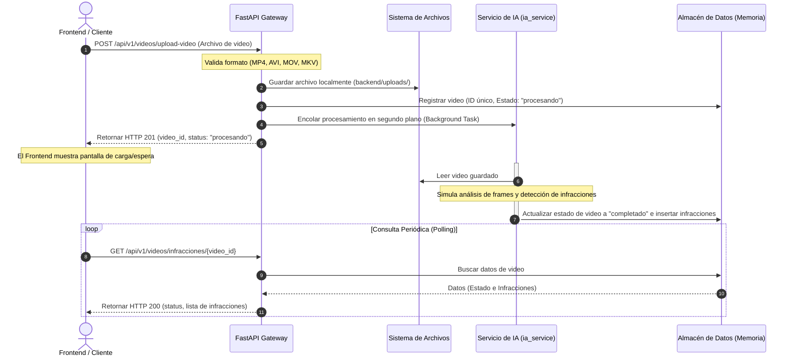

# Documentación de Endpoints de Carga de Video y Detección de Infracciones

Esta documentación describe técnicamente los endpoints del módulo de carga de video y consulta de infracciones viales detectadas por Inteligencia Artificial, localizados en el directorio `backend/app/routes/video_routes.py`.

---

## Arquitectura y Flujo Asíncrono

Dado que el procesamiento de videos mediante modelos de Inteligencia Artificial (detección de objetos, seguimiento de vehículos, OCR de matrículas y matching de reglas de tránsito) es un proceso de cómputo intensivo, los endpoints operan bajo una **arquitectura asíncrona desacoplada**.

A continuación se detalla el flujo de secuencia:



---

## 1. Subir Video para Análisis
Recibe un archivo de video desde el cliente, valida su formato, lo almacena físicamente en el servidor de forma eficiente y agenda la tarea de procesamiento por IA en segundo plano.

* **Ruta:** `/api/v1/videos/upload-video`
* **Método HTTP:** `POST`
* **Content-Type:** `multipart/form-data`
* **Código de Éxito:** `201 Created`

### Parámetros de la Solicitud (Body)
| Parámetro | Tipo | Requerido | Descripción |
| :--- | :--- | :--- | :--- |
| `file` | `binary` (UploadFile) | **Sí** | Archivo de video a analizar. Formatos permitidos: `.mp4`, `.avi`, `.mov`, `.mkv`. |

### Respuestas

#### Respuesta Exitosa (201 Created)
```json
{
  "video_id": "c6a1e342-9907-4ff8-9f17-578cf2305374",
  "filename": "infraccion_ejemplo.mp4",
  "status": "procesando",
  "message": "Video subido con éxito. El análisis de IA se ha iniciado en segundo plano."
}
```

#### Respuesta por Formato Inválido (400 Bad Request)
```json
{
  "detail": "Formato de archivo '.txt' no soportado. Formatos válidos: .mp4, .avi, .mov, .mkv"
}
```

#### Respuesta por Error Interno del Servidor (500 Internal Server Error)
```json
{
  "detail": "Error al guardar el archivo de video en el servidor."
}
```

---

## 2. Consultar Estado e Infracciones Detectadas
Retorna el estado de procesamiento del video y la lista completa de infracciones detectadas por el servicio de Inteligencia Artificial.

* **Ruta:** `/api/v1/videos/infracciones/{video_id}`
* **Método HTTP:** `GET`
* **Códigos de Respuesta:**
  * `200 OK` (Operación exitosa)
  * `404 Not Found` (El `video_id` no existe en el sistema)

### Parámetros de Ruta (Path Parameters)
| Parámetro | Tipo | Requerido | Descripción |
| :--- | :--- | :--- | :--- |
| `video_id` | `string` (UUID) | **Sí** | Identificador único del video obtenido en la respuesta de la carga. |

### Respuestas según Estado

#### A. Estado: En Procesamiento (`procesando`)
La IA aún está analizando el video. El cliente debe continuar realizando consultas periódicas.
```json
{
  "video_id": "c6a1e342-9907-4ff8-9f17-578cf2305374",
  "filename": "infraccion_ejemplo.mp4",
  "status": "procesando",
  "infracciones": []
}
```

#### B. Estado: Completado con Éxito (`completado`)
El análisis de IA ha finalizado. Se retorna el arreglo completo de infracciones detectadas con detalles de matrícula, caja delimitadora normalizada, confianza y segundo del video en el que ocurrió.
```json
{
  "video_id": "c6a1e342-9907-4ff8-9f17-578cf2305374",
  "filename": "infraccion_ejemplo.mp4",
  "status": "completado",
  "infracciones": [
    {
      "infraccion_id": "inf_c6a1e342_1",
      "timestamp_segundos": 4.82,
      "tipo": "Exceso de velocidad",
      "descripcion": "Vehículo superando el límite de velocidad permitido de la zona (60 km/h).",
      "placa_vehiculo": "KLD-8274",
      "confianza": 0.94,
      "caja_delimitadora": {
        "x_min": 0.25,
        "y_min": 0.3,
        "x_max": 0.45,
        "y_max": 0.52
      }
    },
    {
      "infraccion_id": "inf_c6a1e342_2",
      "timestamp_segundos": 12.3,
      "tipo": "No usar cinturón de seguridad",
      "descripcion": "Conductor o copiloto detectado sin el cinturón de seguridad debidamente colocado.",
      "placa_vehiculo": null,
      "confianza": 0.82,
      "caja_delimitadora": {
        "x_min": 0.35,
        "y_min": 0.4,
        "x_max": 0.5,
        "y_max": 0.58
      }
    }
  ],
  "tiempo_procesamiento_segundos": 6.84
}
```

#### C. Estado: Fallido (`fallido`)
Ocurrió un error en el motor de IA al intentar decodificar o analizar el video.
```json
{
  "video_id": "c6a1e342-9907-4ff8-9f17-578cf2305374",
  "filename": "infraccion_ejemplo.mp4",
  "status": "fallido",
  "infracciones": [],
  "error_message": "Error interno del analizador de video de IA (codec no soportado o archivo corrupto)."
}
```

#### D. No Encontrado (404 Not Found)
```json
{
  "detail": "No se encontró ningún video con el ID 'c6a1e342-9907-4ff8-9f17-578cf2305374' en nuestro sistema."
}
```

---

## Guía de Ejecución y Pruebas Locales

Para levantar y probar estos endpoints localmente, siga los siguientes pasos:

### 1. Requisitos e Instalación
Asegúrese de contar con Python 3.8+ instalado. Instale las dependencias necesarias:

```bash
pip install fastapi uvicorn python-multipart
```

### 2. Iniciar el Servidor de Desarrollo
Navegue a la carpeta raíz del proyecto y ejecute `uvicorn` apuntando al punto de entrada de la aplicación:

```bash
cd backend
uvicorn app.main:app --reload
```

El servidor estará disponible en: [http://127.0.0.1:8000](http://127.0.0.1:8000)

### 3. Probar la API de forma Interactiva
Abra su navegador e ingrese a [http://127.0.0.1:8000/docs](http://127.0.0.1:8000/docs) para acceder a la **Swagger UI** oficial del sistema, donde podrá cargar archivos reales de video directamente desde la interfaz gráfica del navegador y consultar sus estados de inmediato.

### 4. Prueba por Consola (curl)
Puede realizar pruebas de carga de archivos por consola con la herramienta `curl` en su terminal:

```bash
# 1. Cargar el archivo de video (reemplace "ruta/a/mi_video.mp4" por un archivo de video local real)
curl -X POST "http://127.0.0.1:8000/api/v1/videos/upload-video" -F "file=@ruta/a/mi_video.mp4"

# 2. Consultar infracciones (reemplace "TU_VIDEO_ID" por el video_id recibido en el paso 1)
curl -X GET "http://127.0.0.1:8000/api/v1/videos/infracciones/TU_VIDEO_ID"
```
