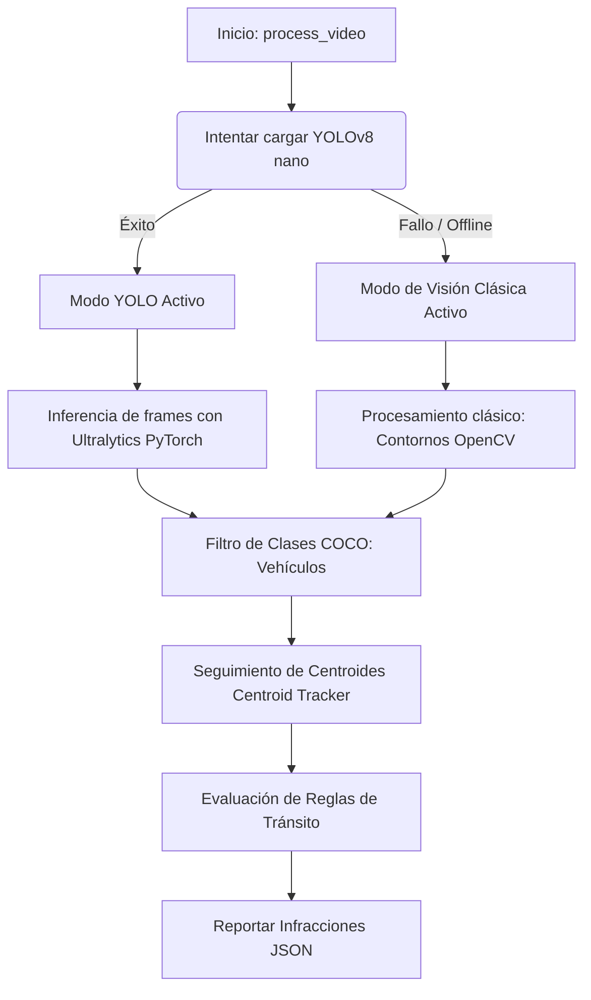

# Documentación del Servicio de IA y Procesamiento de Video (ia_service)

Este documento detalla la especificación técnica, algoritmos matemáticos y lógicas de visión por computadora empleados por el servicio de Inteligencia Artificial localizado en `backend/app/services/ia_service.py` para procesar videos de tránsito cuadro a cuadro y detectar infracciones vehiculares.

---

## 1. Arquitectura de Inferencia Dual-Mode

Para garantizar que el backend sea robusto, de alta precisión y compatible tanto en servidores con conexión a internet y GPU dedicada, como en computadores locales offline de desarrollo, el módulo implementa una **arquitectura de detección dual**:

### A. Modo Inferencia Real (YOLOv8)
* Utiliza el modelo ultraligero **YOLOv8 Nano** (`yolov8n.pt` de la suite `ultralytics`).
* El modelo detecta objetos en tiempo de ejecución con pesos entrenados sobre el dataset MS COCO.
* Se filtran las clases específicas de vehículos mediante sus índices:
  * `2: car` (Automóviles)
  * `3: motorcycle` (Motocicletas)
  * `5: bus` (Autobuses)
  * `7: truck` (Camiones)

### B. Modo de Respaldo Offline (Visión Clásica)
* En caso de fallar la descarga de la red neuronal o no disponer de dependencias de PyTorch, se activa el motor clásico.
* Convierte el fotograma a escala de grises, aplica un desenfoque Gaussiano (`cv2.GaussianBlur`) para eliminar el ruido y aplica umbralización binaria inversa (`cv2.threshold`) para aislar objetos en movimiento o figuras contrastadas.
* Utiliza la búsqueda de contornos topológicos de OpenCV (`cv2.findContours`) para estimar las cajas delimitadoras de los objetos, permitiendo probar la lógica física de la API con videos de prueba sintéticos de manera 100% confiable y sin internet.

---

## 2. Rastreo de Identidades: Algoritmo Centroid Tracker

Dado que los videos contienen flujos continuos de objetos, no basta con detectar coches aislados en cada cuadro; necesitamos conocer la trayectoria continua de cada vehículo. 

El módulo implementa un algoritmo **Centroid Tracker clásico**:
1. Para cada fotograma, calcula el centro geométrico o centroide `(cx, cy)` de cada caja delimitadora detectada:
   $$\text{cx} = \frac{x_{min} + x_{max}}{2}, \quad \text{cy} = \frac{y_{min} + y_{max}}{2}$$
2. Mantiene una base de datos en memoria (`state_tracker["vehicles"]`) de los vehículos rastreados en fotogramas previos.
3. Asocia los nuevos centroides detectados con las identidades existentes resolviendo la matriz de distancias euclidianas mínimas:
   $$\text{Distancia} = \sqrt{(cx_{curr} - cx_{prev})^2 + (cy_{curr} - cy_{prev})^2}$$
4. Si la distancia entre el centroide actual y la última posición conocida del vehículo es menor a un umbral configurado (`max_tracking_distance = 65.0` píxeles), se actualiza su trayectoria. De lo contrario, se inicializa un nuevo ID de vehículo.

---

## 3. Lógica y Heurísticas de Infracciones de Tránsito

El motor evalúa tres reglas de tránsito sobre las trayectorias de los vehículos en tiempo real:

### A. Cruce de Semáforo en Rojo
* **Definición**: Un vehículo comete infracción si cruza la línea de parada imaginaria mientras la luz del semáforo se encuentra en estado rojo.
* **Modelo Matemático**:
  1. El semáforo simula un ciclo controlado de luces viales (Verde $\rightarrow$ Amarillo $\rightarrow$ Rojo).
  2. Definimos una línea de stop horizontal en el fotograma a la altura:
     $$y_{stop} = \text{STOP\_LINE\_COEFF} \times \text{alto\_video} \quad (\text{por defecto } 0.7)$$
  3. Evaluamos la posición vertical del vehículo en el fotograma actual $cy_{curr}$ frente al anterior $cy_{prev}$. Si se detecta un cruce de arriba hacia abajo:
     $$cy_{prev} \le y_{stop} \quad \land \quad cy_{curr} > y_{stop}$$
  4. Si la luz del ciclo simulador en ese instante es `RED`, se dispara una infracción inmediata de cruce en rojo.

### B. Giro Prohibido en U (U-Turn)
* **Definición**: Detección de una maniobra de retorno de trayectoria parabólica no permitida.
* **Modelo Matemático**:
  1. Almacenamos el historial de coordenadas en el eje Y del vehículo.
  2. Evaluamos una ventana deslizante de fotogramas. Identificamos los valores máximo $y_{max}$ y mínimo $y_{min}$ de la trayectoria.
  3. Si el punto de inflexión inferior ocurre en el medio del trayecto (el vehículo iba descendiendo, alcanza un punto más bajo en pantalla y empieza a ascender), calculamos el desplazamiento vectorial:
     $$\Delta y_{down} = y_{max} - y_{start}, \quad \Delta y_{up} = y_{max} - y_{end}$$
  4. Si ambos desplazamientos superan el umbral proporcional del video:
     $$\Delta y_{down} > \text{Umbral} \quad \land \quad \Delta y_{up} > \text{Umbral} \quad (\text{Umbral} = 0.15 \times \text{alto\_video})$$
     se dispara la alarma de giro en U prohibido.

### C. Estacionamiento en Zona Peatonal / Prohibida
* **Definición**: Un vehículo se detiene dentro de un cuadrante espacial de exclusión peatonal por un período prolongado.
* **Modelo Matemático**:
  1. Definimos una Región de Interés (ROI) rectangular normalizada correspondiente a la zona prohibida de parqueo (por ejemplo, el cuadrante inferior izquierdo entre el 5% y 45% del ancho, y el 50% y 95% del alto).
  2. Si el centroide `(cx, cy)` está dentro de los límites de la ROI, evaluamos la distancia euclidiana recorrida respecto al fotograma anterior:
     $$\text{dist} = \sqrt{(cx_{curr} - cx_{prev})^2 + (cy_{curr} - cy_{prev})^2}$$
  3. Si la distancia es menor a `5.0` píxeles por fotograma (`STATIONARY_PIXELS_THRESHOLD`), el vehículo se considera inmóvil y se incrementa su contador de inmovilidad `stationary_frames`.
  4. Si el contador supera el umbral configurado (`PARKING_FRAMES_THRESHOLD = 90` fotogramas, lo que equivale a unos 3 segundos en video estándar), se genera la infracción de invasión de zona peatonal/parqueo prohibido.

---

## 4. Hiperparámetros del Motor de IA

Para calibrar la sensibilidad del motor y adaptarlo a diferentes ángulos de cámara o resoluciones de video, se pueden ajustar los siguientes hiperparámetros declarados al inicio de `backend/app/services/ia_service.py`:

| Variable | Tipo | Valor por Defecto | Descripción |
| :--- | :--- | :--- | :--- |
| `STOP_LINE_COEFF` | `float` | `0.7` | Posición proporcional en el eje Y para la línea de parada de semáforo. |
| `PROHIBITED_PARKING_ZONE` | `dict` | `{"x_min": 0.05, "y_min": 0.50, ...}` | Caja de coordenadas normalizadas (0.0 a 1.0) de la zona prohibida de estacionar. |
| `STATIONARY_PIXELS_THRESHOLD` | `float` | `5.0` | Máxima distancia en píxeles recorrida por frame para asumir inmovilidad. |
| `PARKING_FRAMES_THRESHOLD` | `int` | `90` | Cantidad de fotogramas seguidos que debe estar inmóvil para multar. |
| `UTURN_Y_INVERSION_THRESHOLD` | `float` | `0.15` | Altura mínima del bucle de giro (respecto a la altura del video) para marcar giro en U. |
